# Hamburgueria
Sistema de Hamburgueria em Java como trabalho final de "Design Patterns" da disciplina de "Arquitetura e Projeto de Software" na graduação em Engenharia de Software

**Comando:** 
> Aplicar todos os 23 padrões de projeto em um **Sistema de atendimento fastfood para Hamburgueria** usando Java Maven + JUnit

**Referências técnicas principais:** [Refactoring Guru](https://refactoring.guru/design-patterns/) e [Repositório do professor](https://github.com/marcoaparaujo/padroes-projeto)

---

## Padrões e diagramas

| # | Padrão (Categoria) | Classes principais no domínio |
| :-: | :--- | :--- |
| 1 | Singleton (Criacional) | CaixaRegistradora |
| 2 | Factory Method (Criacional) | FabricaLanche |
| 3 | Abstract Factory (Criacional) | FabricaIngredientes |
| 4 | Builder (Criacional) | LancheBuilder + CardapioDirector |
| 5 | Prototype (Criacional) | CombinacaoPredefinida + RegistroCombos |
| 6 | Adapter (Estrutural) | AdaptadorGatewayExterno |
| 7 | Bridge (Estrutural) | ItemMenu × MetodoPreparo |
| 8 | Composite (Estrutural) | ItemCardapio |
| 9 | Decorator (Estrutural) | LancheDecorator |
| 10 | Facade (Estrutural) | PedidoFacade |
| 11 | Flyweight (Estrutural) | TipoIngrediente + FabricaIngredientesFlyweight |
| 12 | Proxy (Estrutural) | ProxyEstoque |
| 13 | Chain of Responsibility (Comportamental) | AprovadorDesconto |
| 14 | Command (Comportamental) | PedidoCommand + Garcom |
| 15 | Interpreter (Comportamental) | ExpressaoCupom |
| 16 | Iterator (Comportamental) | CardapioIterator |
| 17 | Mediator (Comportamental) | AtendimentoMediator / CentralAtendimento |
| 18 | Memento (Comportamental) | PedidoMemento + HistoricoPedido |
| 19 | Observer (Comportamental) | PedidoObservavel + observadores |
| 20 | State (Comportamental) | EstadoPedido |
| 21 | Strategy (Comportamental) | EstrategiaEntrega |
| 22 | Template Method (Comportamental) | PreparoLanche |
| 23 | Visitor (Comportamental) | RelatorioVisitor |

### Diagramas

#### Resumo técnico - Notação UML

##### Atributos e Métodos
| Símbolo | Nome | Descrição |
| :---: | :--- | :--- |
| **`+`** | Público / Public | O elemento é visível por qualquer outra classe. |
| **`-`** | Privado / Private | O elemento só pode ser acessado de dentro da própria classe. |
| **`#`** | Protegido / Protected | Visível apenas para a própria classe e suas subclasses (herança). |
| **`~`** | Pacote / Package | Visível apenas por classes dentro do mesmo pacote (package-private). |

##### Relacionamentos (Linhas e Setas)
| Elemento Visual | Linha | Seta | Significado |
| :---: | :--- | :--- | :--- |
| **`——-—▷`** | Contínua | Triangular, Fechada e Vazia | Herança / Extensão |
| **`-- - ▷`** | Tracejada | Triangular, Fechada e Vazia | Implementação |
| **`——-—>`** | Contínua | Aberta (em "V") | Associação Direcionada |
| **`-- - >`** | Tracejada | Aberta (em "V") | Dependência |
| **`♢——-—`** | Contínua | Losango Vazio (na origem) | Agregação |
| **`♦——-—`** | Contínua | Losango Preenchido (na origem) | Composição |

##### Multiplicidade
| Notação | Significado | Descrição |
| :---: | :--- | :--- |
| **`1`** | Exatamente uma instância | Obrigatório e exclusivo |
| **`0..1`** | Zero ou uma instância | Opcional |
| **`*`** ou **`0..*`** | Zero ou múltiplas instâncias | Lista aberta que pode ser vazia |
| **`1..*`** | Uma ou múltiplas instâncias | Obrigatório ao menos uma |

#### Diagrama geral
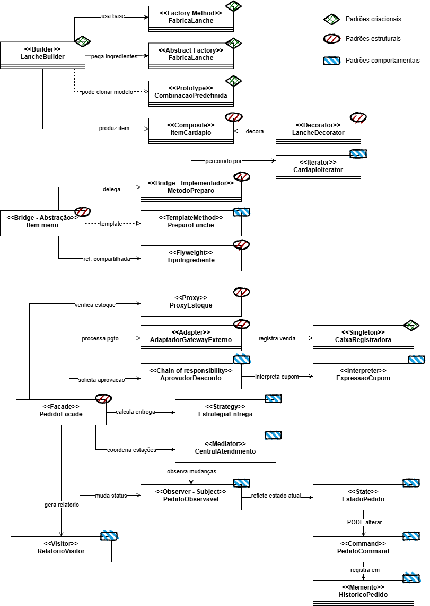

#### Diagramas por padrão
##### Criacionais (Total: 5)
Mecanismos de criação de objetos, tentando criar objetos de forma adequada à situação.

01. Singleton
> Função: garantir que uma classe tenha **apenas uma instância** e fornecer um ponto de acesso global a ela.

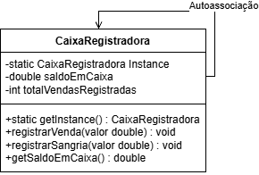

02. Factory Method
> Função: definir uma **interface para criar** um objeto, mas deixar subclasses definirem qual classe instanciar.

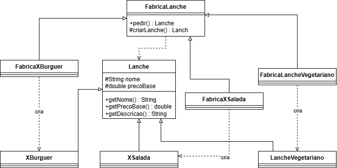

03. Abstract Factory
> Função: fornecer uma interface para **relacionar** objetos sem especificar suas classes concretas.

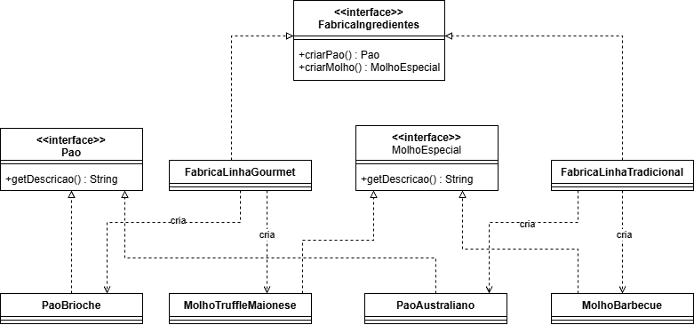

04. Builder
> Função: separar a construção de um **objeto complexo**, permitindo criar diferentes representações usando o mesmo processo de construção.

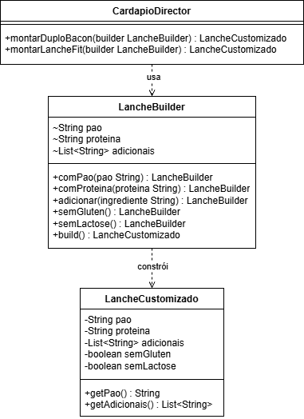

05. Prototype
> Função: especificar os tipos de **objetos a serem copiados** através de um protótipo.

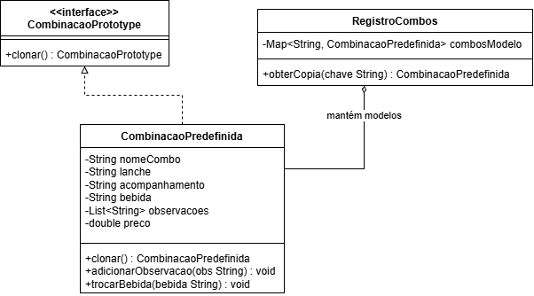

##### Estruturais (Total: 7)
Composição de classes e objetos que formam estruturas maiores, flexíveis e mais eficientes.

06. Adapter
> Função: **converter** / "adaptar" interfaces, permitindo que classes incompatíveis trabalhem juntas.

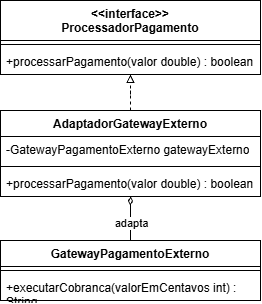

07. Bridge
> Função: **desacopla** a abstração da implementação para permitir variações independentes.

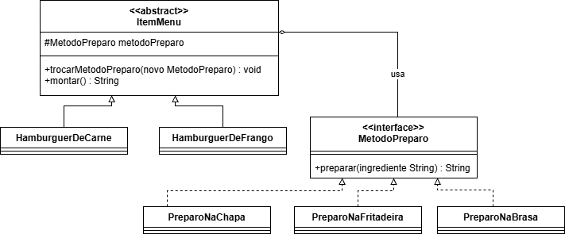

08. Composite
> Função: compor objetos em **estruturas de árvore** para representar hierarquias parte-todo, permitindo tratar objetos individuais e composições de forma parecida.

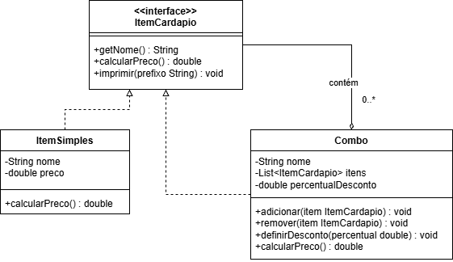

09. Decorator
> Função: dá responsabilidades **adicionais** a um objeto dinamicamente, é uma alternativa à herança.

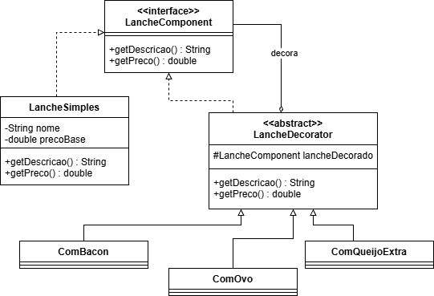

10. Facade
> Função: uma **interface simplificada** de um conjunto de interfaces para facilitar o uso.

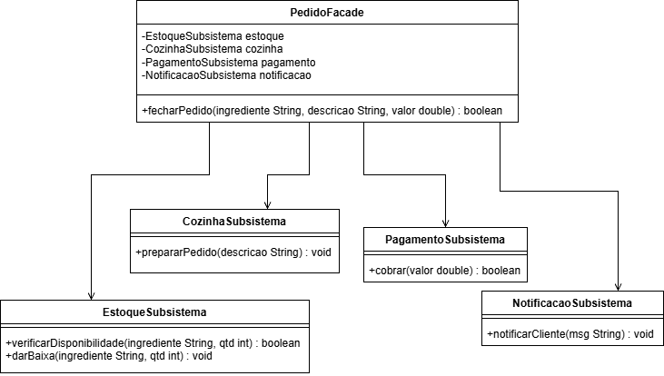

11. Flyweight
> Função: suportar **grandes quantidades de objetos** usando compartilhamento de elementos em comum.

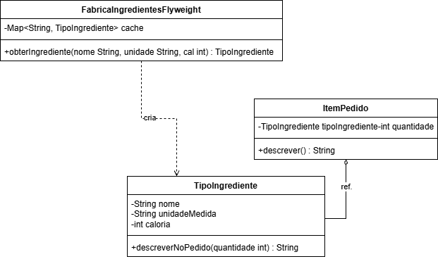

12. Proxy
> Função: **controlar o acesso** a um objeto através de um marcador / substituto.

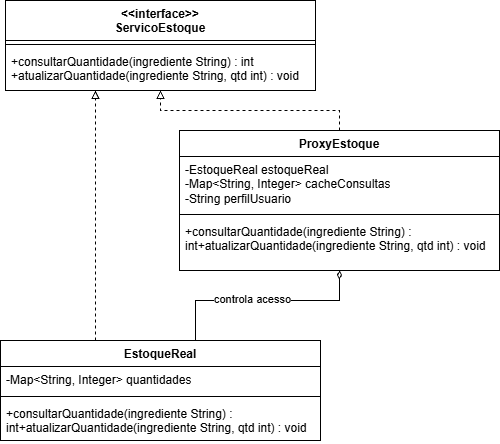

##### Comportamentais (Total: 11)

13. Chain of Responsibility
> Função: **encadeia** uma solicitação até "alguém" tratar

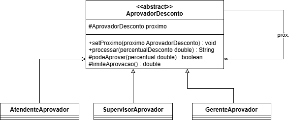

14. Command
> Função: encapsular uma solicitação, permitindo **parametrizar / enfileirar /  registrar operações**, suportando inclusive que elas possam ser desfeitas.

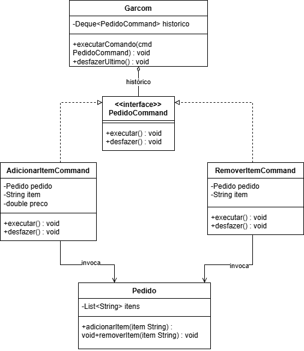

15. Interpreter
> Função: usar uma "representação gramática" para **interpretar sentenças de linguagem**.

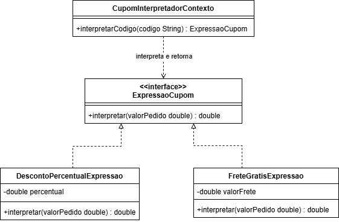

16. Iterator
> Função: acessar elementos de um objeto agregado sem expor a representação interna.

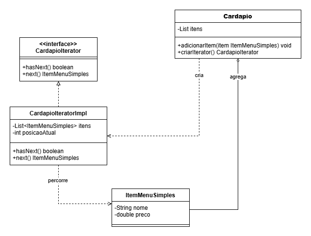

17. Mediator
> Função: **determina como um conjunto de objetos interage**, evitando que objetos se refiram uns aos outros explicitamente.

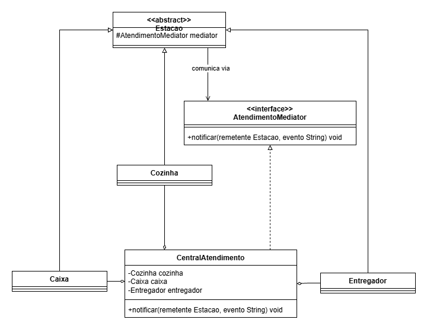

18. Memento
> Função: capturar o estado de um objeto para que ele possa ser restaurado quando necessário, sem violar encapsulamento.

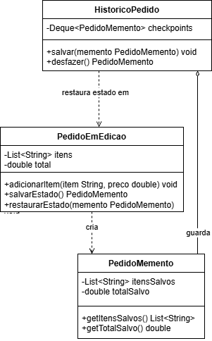

19. Observer
> Função: quando um objeto muda de estado, notifica os dependentes para que atualizem automaticamente.

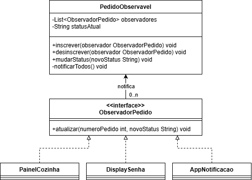

20. State
> Função: **altera o comportamento de um objeto** quando seu estado muda, "parecendo" que o objeto mudou de classe.

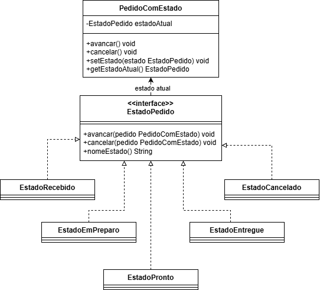

21. Strategy
> Função: define um conjunto de algoritmos (estratégias) que podem ser alternados, permitindo que o algoritmo varie independentemente dos que o cliente utilizar.

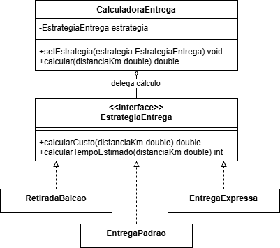

22. Template Method
> Função: é o esqueleto de um algoritmo, deixando alguns pontos para as subclasses definirem, sem alterar a estrutura geral.

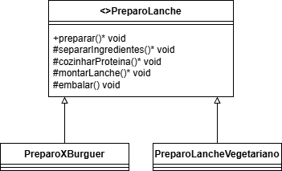

23. Visitor
> Função: uma operação executada em uma lista de objetos, permitindo definir novas operações sem mudar as classes desses elementos.

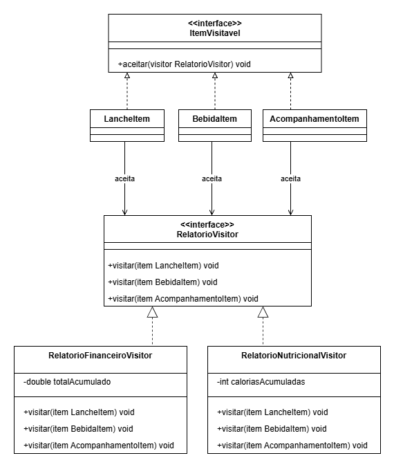
